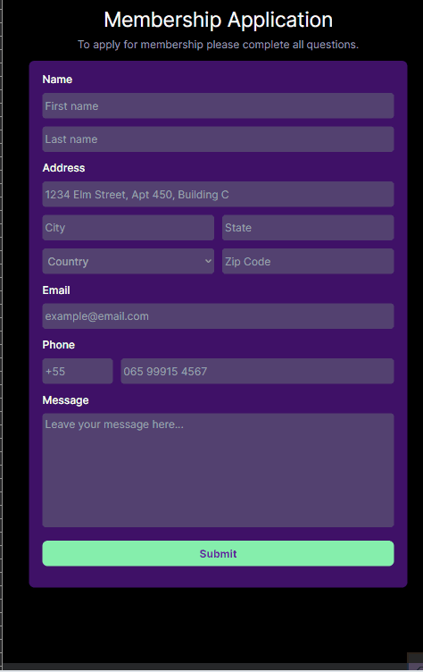

# Membership Application Form 📝

This project is a responsive membership application form developed using [React.js](https://react.dev/)  and some popular libraries such as [React-Hook-Form](https://www.react-hook-form.com/) and [Yup](https://www.npmjs.com/package/yup) for form validation. The form features comprehensive validation for various phone number and ZIP code formats using regular expressions (Regex).

## Features 💡

- Registration form with fields for name, address, email, phone and message.

- Real-time input validation with detailed error messages.

- Display a confirmation modal after successful form submission, showing the provided first name, last name and email.

## Technologies ⚙️

## Overview 📱

